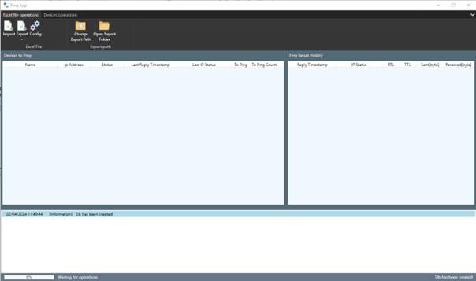
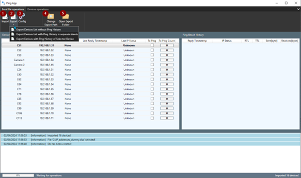
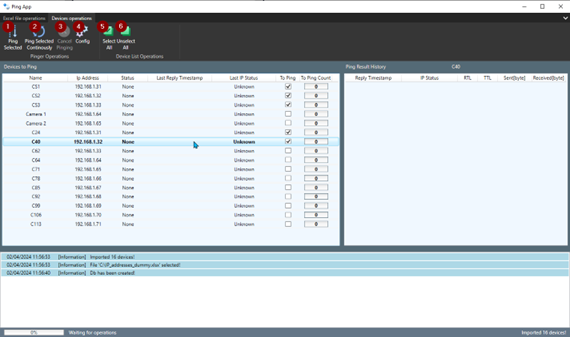
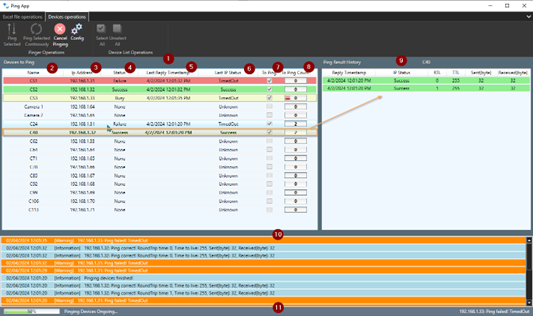
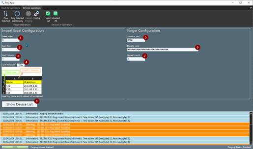

Desktop App (win-x64) that allows to ping devices by the definition imported from Excel File.

Description:

Ribbon of application contains 2 tabs:

1. Excel File Operations

(1) Import – allows to import devices definition from excel file (name and IP address).

NOTE: selecting this operations clears previous operations results (including Ping Result History)

(2) Export – allows to export devices list to excel file:

-without Ping History (single-sheet worksheet, showing only last ping status of devices)

-with Ping History (last ping status of devices and every device’s ping history in separate sheets)

-with Ping History of selected device(last ping status of devices and ping history of selected device in separate sheet)

(3) Config – opens config view (described below)

(4) Change Export Path – select folder where exported excel files will be put

(5) Open Export Folder – opens folder where exported excel files will be (were) put

2. Devices Operations

(1) Ping Selected – starts to ping selected devices

(2) Ping Selected Continuously – starts to ping selected devices continuously

(3) Cancel Pinging – cancels ping sequence

(4) Config - opens config view (described below)

(5) Select All – selects all devices to ping

(6) Unselect All – unselects all devices to ping

Under the ribbon of application there is:

(1) Device List – shows imported devices which user can try to ping

Each Device contains

(2) Name

(3) IP Address

(4) Status – status of operations on the device. By this information style of row is changed.

(5) Last Reply Timestamp – Date and time of last ping operation on device

(6) Last IP Status – Status of last ping operation on device

(7) To Ping – check box which allow to select device to ping

(8) Is Ping Count – this column informs about:

-text value informs about this device’s ping attempts be done in this sequence

-progress bar informs about timeout of actual ping attempt

(9) Ping Result History – show ping result history (stored in SQLite db) of selected device

Below Device List there is:

(10) Logger – shows operations status

(11) Status bar – shows:

-progress bar showing progress of ping sequence (right corner)

-last log (left corner)

There is also config view (opened with specific ribbon buttons)

Config view is divided to 2 sections:

1. Import Excel Configuration:

(1) Sheet index – index of sheet from which devices definition is to be imported (0 is default)

(2) Start row – in which row there is 1st device stored

(3) Start column – in which column there is name stored (IP address should be stored in next column)

(4) Show/Hide Excel template

2. Pinger Configuration

(1) Timeout(in milliseconds) of ping operation

(2) Data to send to device

(3) Repeat count – how many times ping will be repeated for each device in single ping sequence

(8) Button Show Device List allow to switch view to Device List.
